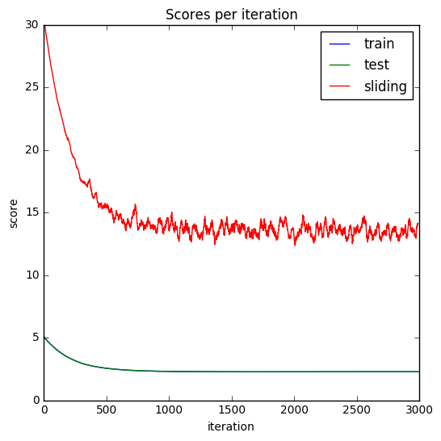
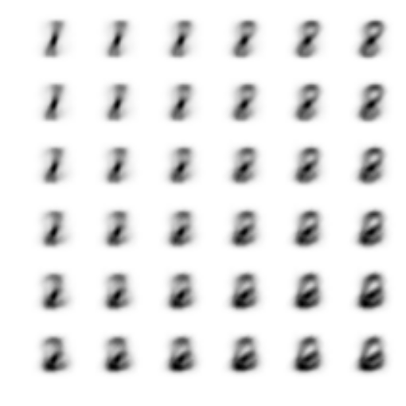
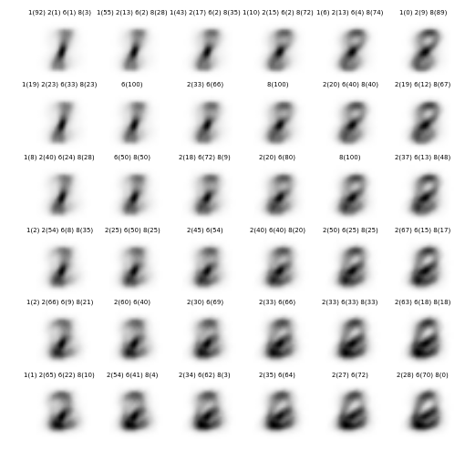
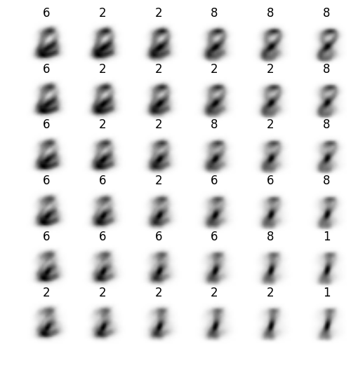
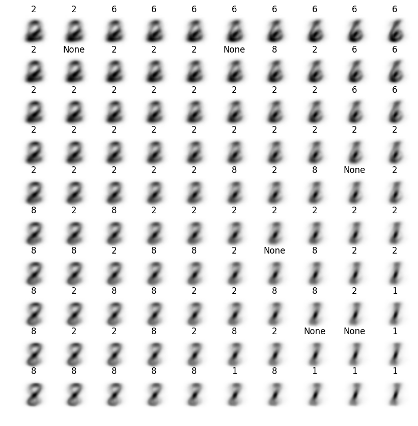
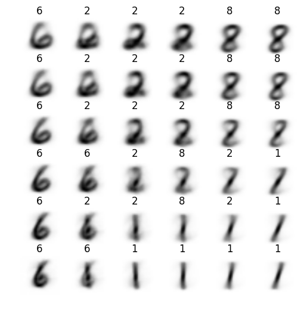
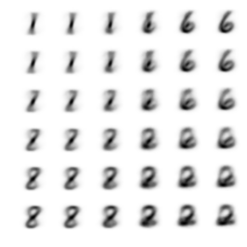

# Kohonen maps on hand-written digits 

Using [MNIST dataset](http://yann.lecun.com/exdb/mnist/), this project shows how Kohonen maps can be adapted to classify 4 selected hand-written digits. It suggests a method to assign digits to Kohonen prototypes and analyze the variation of parameters: network size, neighborhood function width.

## Learning rate

Starting with default parameters ($36$ neurons, unit distance, $\sigma=3$), the learning rate has been empirically chosen based on the number of iteration. $\eta=0.005$ seems to converge fast enough with accurate precision over $5000$ iterations.

The convergence is determined using $L2$-norm over all samples (slow): once the gradient of the norm stablizes around 0 given a threshold tolerance (e.g. $0.0025$ works well with a learning rate of $\eta=0.005$). In order to keep the algorithm efficient, a $10$-elements sliding window over the train samples is used to approximate the full norm (used as convergence criteria, not for evaluation).

Comparison of train, test, sliding norms learning curve.

## Prototypes

Each four digit ($4\cdot 500=2000$ samples) is represented by a $28\cdot 28=784$ pixels array with support $\in [0, 255]\subset \mathbb{N}$. The competitive learning specialized each prototypes to represent one kind of hand-written digits. Corners are far away from each others and thus represents the highest variation with recognizable digits. The prototypes in-between show how the variation progress from one corner to another. For instance the top-right corner is specialized to represent the digit $8$. By comparing to top-left one, the prototype show how one can change the digit 1 to obtain digit 8.

Prototypes for ($36$ neurons, unit distance, $\sigma=3$, $\eta=0.005$, $t=5000$). The top-left corner has mostly $1$s, the top-right $8$s, the bottom-left $2$s and the bottom-right $6$s.

## Digit assignment

To assign automatically each prototypes to a digit, the closest the prototype is chosen for each sample. Gathering then all samples having the same closest prototype give an empirical repartition from which the highest occuring label can be picked up. This give to each prototype the label that is most represented by itself and achieve an error rate of $~30.65$ %. The following show how tuning parameters affect this result.

This show the digit repartition (%) for each prototypes by selecting the closest prototype over all samples.

## Exploration

### Network size

The network size affects the specialisation of each prototypes. The largest the network is the more different prototypes and more intermediate representation between two digits there will be. This allow more flexible assignements but could lead to some sparsity in the assigments (some prototypes do not represent any specific digits, assigning them to the closest one could be solution).

$64$ neurons, $\sigma=3$, error $0.11$ % / $100$ neurons, $\sigma=3$, error $18$ % / $144$ neurons, $\sigma=3$, error $0.12$ %

### Neighborhood function width

The neighborhood function width affects the generality of the prototypes. When small neighboring function are used, the current step update is mostly based on the winner neuron whereas when large ones are used, the current step update include larger contribution from loser neurons leading to less precise prototypes. The optimal width depends on the size of the Kohonen map. A low/high width will work well with a small/big network.

$36$ neurons, $\sigma=1$, error $11$ % / $36$ neurons, $\sigma=3$, error $32$ % / $36$ neurons, $\sigma=5$, error $23$ %

$100$ neurons, $\sigma=5$

### Dynamic neighborhood function width

Varying the neighborhood function width over time affects the convergence. This allows the network to stablize the network by being more plastic at the begining and more rigid at the end resulting in a faster convergence and less prone to final variation.

$36$ neurons, $\sigma=5$, decay rate $0.5$, error $20$ % / $36$ neurons, $\sigma=5$, decay rate $0.85$, error $26$ % / $36$ neurons, $\sigma=5$, decay rate $0.95$, error $32$ %

## Final point

Exploration different parameter settings showed how different choice impact the specifity, generality and convergence of the prototypes. By fine tuning these, the initial result can be improved to reach better error rates and thus a better representation in the network.

